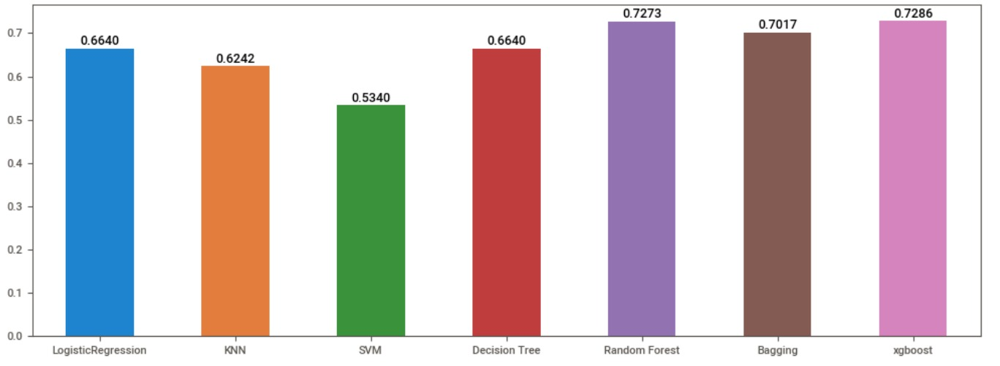

# Sales Lead Classification

## Project Details

Project ID: PTID-CDS-JAN-24-1768
Project Code: PM-PR-0019
Client: FicZon Inc

---

## Business Problem

FicZon relies on manual lead classification, which reduces sales efficiency.

This project uses machine learning to classify leads into:

* High Potential (HP)
* Low Potential (LP)

---

## Dataset

* Source: SQL database
* Records: 7,422
* Dataset not included due to privacy

---

## Data Processing

* Missing values handled
* Date converted to month/day
* Categorical encoding applied
* SMOTE used for class balancing

---

## Models Used

* Logistic Regression
* KNN
* SVM
* Decision Tree
* Random Forest
* Bagging
* Gradient Boosting
* XGBoost

---

## Results

* Best Model: Random Forest
* Accuracy: ~73%

---

## Visualizations

### Lead Distribution


### Model Comparison



---

## Project Documentation

Business case available in:

docs/business_case.pdf

---

## How to Run

```bash
git clone https://github.com/JavSanthosh/Sales-Effectiveness
cd Sales-Effectiveness
pip install -r requirements.txt
jupyter notebook
```

---

## Author

Santhosh
